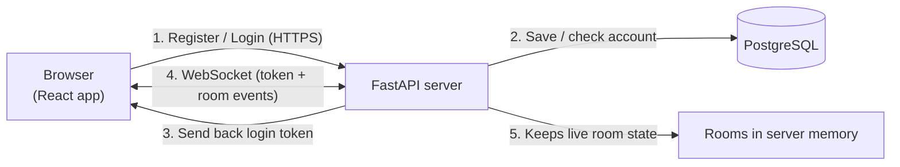
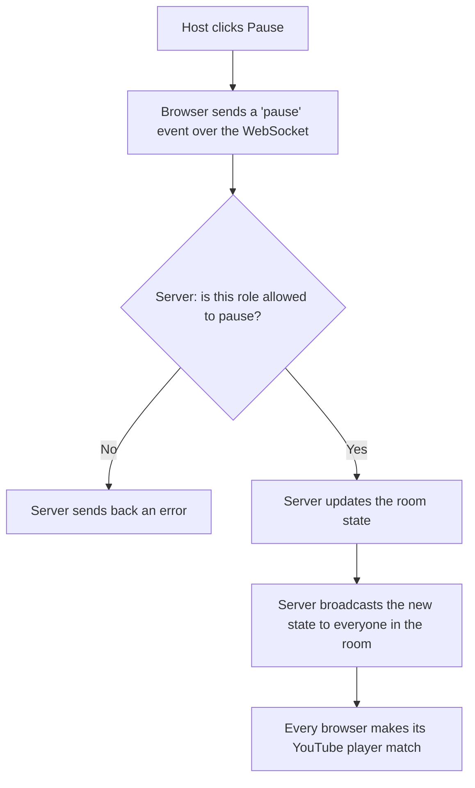
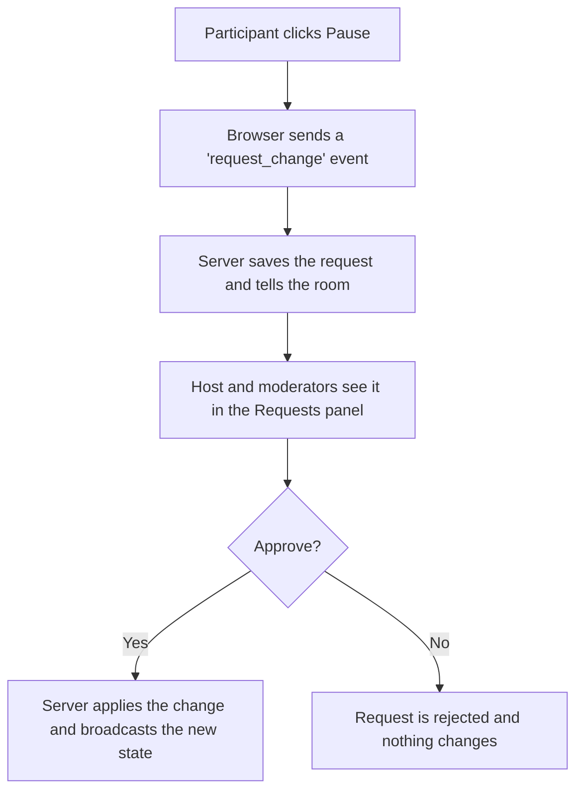

# 🎬 Matinee: YouTube Watch Party

> Watch YouTube videos together with your friends, perfectly in sync. Create a room, share the code, and press play.

---

## 🌐 Live Demo

🔗 **<https://matinee-watch-party.vercel.app>**

> ⏳ The backend runs on a free Render plan and goes to sleep when nobody uses it, so the very first load (or login) can take up to a minute. After that it is fast.

---

## 📖 About

Matinee is a full-stack watch party app. One person creates a room and becomes the host. Friends join with a 6-character code or an invite link. When the host plays, pauses, seeks or changes the video, **everyone sees the same thing at the same time**, thanks to WebSockets.

People who are not the host can still take part: they can *ask* for a change, and the host or a moderator approves or rejects it.

---

## ✨ Features

- 🎥 **Real-time sync:** play, pause, seek and video changes reach everyone instantly
- 🔐 **Login and accounts:** register and log in before joining a room (passwords are hashed and stored in PostgreSQL)
- 🏠 **Rooms:** create a room and share its code or invite link
- 👑 **Roles:** Host, Moderator, Participant and Viewer, each with different powers
- ✋ **Request and approve:** participants ask for a change, the host or a moderator says yes or no
- 📝 **Video queue:** line up videos and the next one starts automatically
- 💬 **Live chat** and 🎉 **floating emoji reactions**
- 🔄 **Automatic host handover:** if the host leaves, someone else takes over
- 🛡️ **Server-side permission checks:** hiding a button is never the only protection

---

## 🧱 Tech Stack

| Part | Technology |
| --- | --- |
| Frontend | React + Vite |
| Backend | Python + FastAPI |
| Real-time | WebSockets |
| Database | PostgreSQL (Neon) |
| Login | bcrypt + JWT tokens |
| Video | YouTube IFrame API |
| Hosting | Vercel (frontend) + Render (backend) |

---

## 🔐 Roles

| Role | How you get it | What you can do |
| --- | --- | --- |
| **Host** | You created the room | Everything: control the video, manage the queue, assign roles, remove people, hand over the host role |
| **Moderator** | Host promotes you | Play, pause, seek, change video, manage the queue, approve or reject requests |
| **Participant** | Default when you join | Watch, chat, react, and send requests |
| **Viewer** | Host assigns it | Same as a participant (a separate label if the host wants to tell people apart) |

---

## 🏗 Architecture overview

Matinee uses two kinds of connection, each for one job:

- **Normal HTTPS requests** are used only for **register and login**. The server checks or saves the account in PostgreSQL and sends back a login token.
- **A WebSocket** is used for everything inside a room. It stays open, so the server can push updates to everyone the moment something happens, without anyone refreshing or asking.



**The server is the single source of truth.** Browsers never talk to each other. Every action goes to the server first, and the server decides what happens.

### What happens when the host clicks pause



### What happens when a participant clicks pause



### Keeping everyone in sync

- The server remembers the video position together with the time of the last update, so it can work out where the video should be at any moment.
- Someone who joins late is sent that position and lands in the right place.
- Every browser checks its own player every second or so, and jumps back in line if it drifts too far.

---

## 🚀 Run it locally

You need **Python 3.10+**, **Node.js** and a free PostgreSQL database (for example from [Neon](https://neon.tech)).

### 1. Backend

```bash
cd backend
pip install -r requirements.txt
```

Create a file named `.env` inside `backend`:

```
DATABASE_URL=your_postgres_connection_string
SECRET_KEY=any_long_random_text
CORS_ORIGINS=http://localhost:5173
```

Start the server:

```bash
python -m uvicorn main:app --reload
```

It runs on `http://localhost:8000`. Open `/health` to check that the database is connected.

### 2. Frontend

Open a second terminal:

```bash
cd frontend
npm install
npm run dev
```

Open `http://localhost:5173` in your browser.

---

## 📝 Environment variables

**Backend**

| Variable | What it is |
| --- | --- |
| `DATABASE_URL` | PostgreSQL connection string |
| `SECRET_KEY` | Secret used to sign login tokens |
| `CORS_ORIGINS` | The frontend address that is allowed to call the backend |

**Frontend**

| Variable | What it is |
| --- | --- |
| `VITE_API_URL` | Backend address, e.g. `https://matinee-watch-party.onrender.com` |
| `VITE_WS_URL` | WebSocket address, e.g. `wss://matinee-watch-party.onrender.com/ws` |

---

## 🌍 Deployment

| Service | Platform | URL |
| --- | --- | --- |
| Frontend | Vercel | <https://matinee-watch-party.vercel.app> |
| Backend | Render | <https://matinee-watch-party.onrender.com> |

---

## ⚠️ Good to know

- Accounts are stored permanently in PostgreSQL, but **live rooms are kept in the server's memory**. If the server restarts, active rooms end and everyone has to create or join a room again.
- The app runs on a single server. Handling many more users would need a shared layer such as Redis.
- A few YouTube videos do not allow embedding and cannot be played here.
- Browsers may block autoplay, so the app shows a **Click to start playback** button when needed.

---

## 🔮 Planned

- 💾 **Persistent rooms:** save room codes in the database so they survive a server restart
- 🤖 **AI chat summary ("Catch me up"):** summarise what was said in the chat for people who join late
- 📈 **Scaling:** run several servers using Redis Pub/Sub